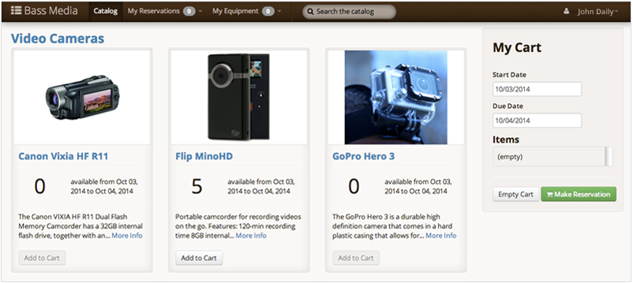

**Reservations** is *the* app to use for keeping track of loaning items! Whether you're an office loaning out work laptops, a library loaning out photography equipment, or a department loaning out anything else, **Reservations** makes your life easier. Reservations:

* manages your inventory of equipment, including storing serial numbers, manuals and other documents, and more.
* presents an attractive catalog of equipment, including pictures, so people can browse and search your equipment.
* allows clients to reserve equipment in advance, according to rules you set.
* enforces rules on who can reserve what equipment, and for how long.
* manages checking equipment in and out, including training/certification and other requirements checklists for each item.

[See the feature overview in greater detail](/reservations/features/) or [take a look at our help documentation](/reservations/user-doc/).
